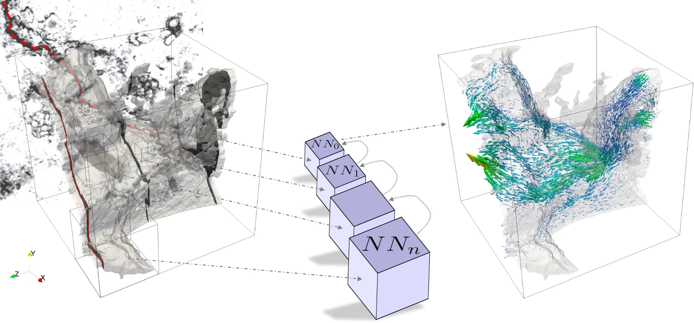
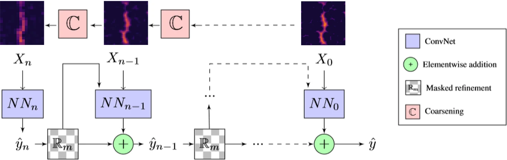

# MS-Net: Computationally Efficient Multiscale Neural Network 
<p align="center">
</img>
</p>
Implementation of <a href="https://link.springer.com/article/10.1007/s11242-021-01617-y">The MS-Net</a> in Pytorch. This model provides an easy and effcient way to train neural networks with computationally large 3D arrays. The application shown in the paper considered simulations of flow through porous materials, but the method is general, and should be applicable to any other application involving large 2D/3D arrays.

## Small example
An example (for electrical conductivity) can be found in this <a href="https://colab.research.google.com/drive/1R-bMTYuNfhFNNnpIWecNa0lPWUCDRa_w?usp=sharing">Google Colab</a>


## Usage

```python
import torch

from network import MS_Net
from pore_utils import rnd_array
from network_tools import get_masks

net = MS_Net( 
              num_scales   := 4,   # num of trainable convNets
              num_features  = 1,   # input features (Euclidean distance, etc)
              num_filters   = 2,   # num of kernels on each layer of the finest model (most expensive)
              summary       = True # print the model summary
)

x     = rnd_array( size=128, scales = num_scales )
masks = get_masks( x[-1],    scales = num_scales )
y     = net( x, masks )[-1] # final prediction
```

## Workflow
The following illustration shows how the information flows through the individual networks.

<p align="center">
</img>
</p>

## Video
A high-level talk describing the MS-Net highlights is posted on [youtube](https://www.youtube.com/watch?v=DCXSdEDJE0E)

## Citation
If you use our code for your own research, we would be grateful if you cite our publication
[TiPM](https://link.springer.com/article/10.1007/s11242-021-01617-y)
```
@article{MSNET,
title = "Computationally Efficient Multiscale Neural Networks Applied to Fluid Flow in Complex 3D Porous Media",
journal = " Transp Porous Med",
year = "2021",
issn = "1573-1634",
doi = "https://doi.org/10.1007/s11242-021-01617-y",
url = "https://link.springer.com/article/10.1007/s11242-021-01617-y"
}
```

